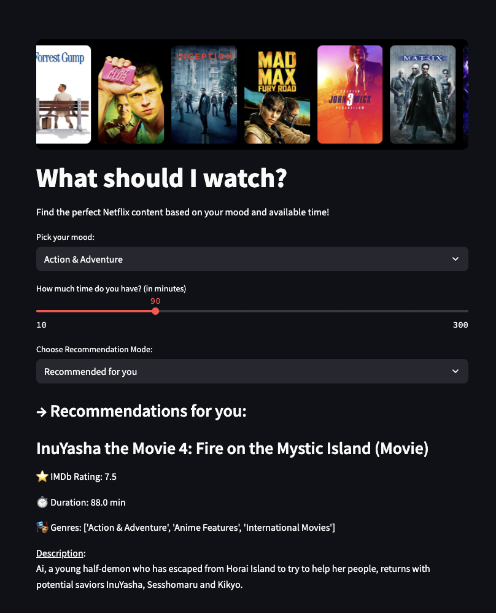
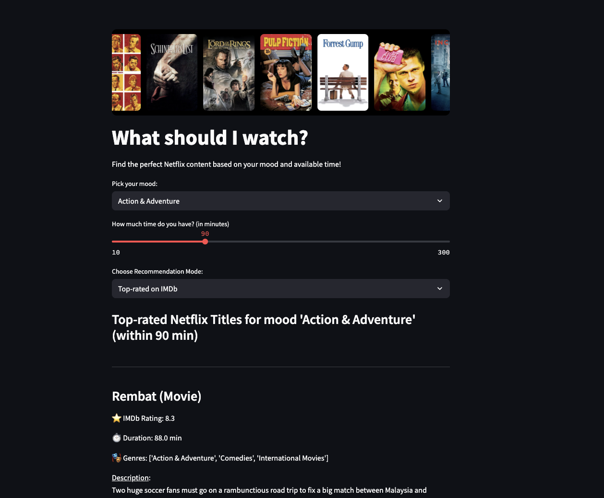

# PopcornPredictor
An intelligent movie recommendation app built with Streamlit and machine learning, tailored to your mood and available time.
<!-- Optional: add screenshot if available -->

---

## Overview

**PopcornPredictor** is a data-driven movie recommendation system built using Python. It leverages machine learning and clustering techniques to suggest movies that match your preferences — whether you're short on time, looking for a feel-good movie, or want AI-powered suggestions.

<!-- Optional: add screenshot if available -->
---

## Features

🔹 **Three recommendation modes**:
1. **🎯 Recommended for You** — Personalized suggestions based on your selected preferences.
2. **🧠 Smart Recommendation (AI-Based)** — Uses KMeans clustering to group similar movies and recommend intelligently.
3. **🏆 Top IMDb Movies** — Displays the highest-rated movies from the IMDb database.

🔹 **Built with Streamlit** for an interactive and easy-to-use web interface.

🔹 Uses **pandas** and **NumPy** for data manipulation and preprocessing.

---

## Tech Stack

- **Python**
- **Streamlit**
- **Pandas**
- **NumPy**
- **Scikit-learn (KMeans)**

---

## Machine Learning Approach

We used the **KMeans clustering algorithm** to group movies based on features such as genre, duration, and IMDb ratings. These clusters help in generating "Smart Recommendations" by identifying similar movies within the same cluster as the user’s preferences.

---

## ⚙️ How to Run Locally

1. Clone the repository:
   ```bash
   git clone https://github.com/yourusername/PopcornPredictor.git
   cd PopcornPredictor

## Create a virtual environment (optional but recommended):

- python -m venv venv
- source venv/bin/activate  # On Windows use `venv\Scripts\activate`

## Install dependencies:

- pip install -r requirements.txt

## Run the app:

- streamlit run app.py

## 📬 Contact

Created by [Aryan Verma](https://aryan-verma.vercel.app/)  
Feel free to reach out for collaboration or questions!
